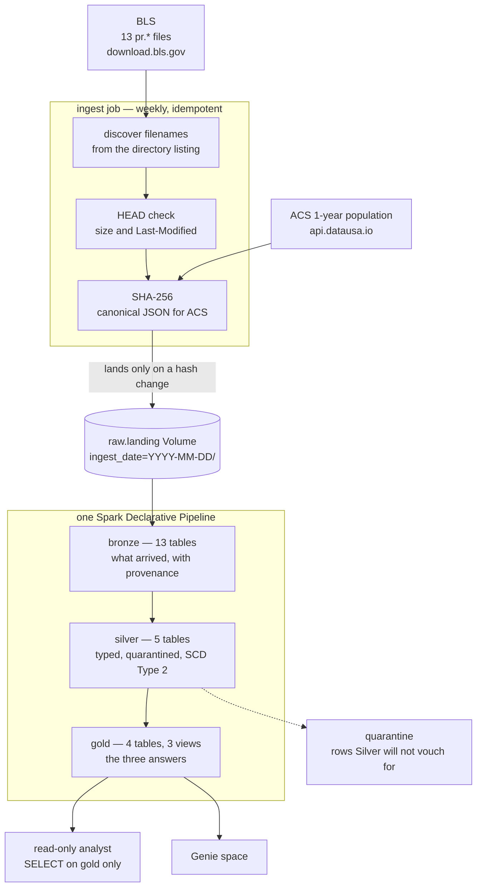
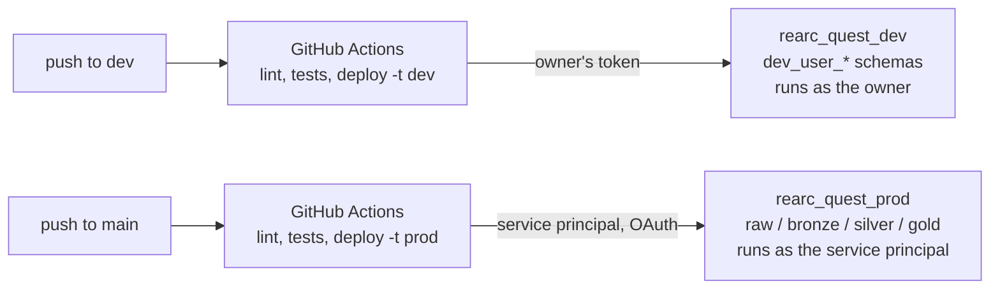

# PROCESS

Why this is built the way it is. Every figure below was measured — from the
downloaded files or by querying the deployed tables. The two published acceptance
values, `PRS30006011` → 2022, 16.4 and `PRS30006032` → 1994, 14.6, reproduce
exactly in dev **and** in an independently built production environment.

---

## Architecture

### The layers, and what each one promises

**Bronze records what arrived.** Rows are never dropped — a malformed record is
evidence about the source, and discarding it at the boundary destroys the only
proof it existed. Expectations are metrics here, not gates. The exception is the
header contract: Bronze splits by position, so a reordered or renamed column
would corrupt every row while the field count still looked correct. That halts
the run.

**Silver claims the data is correct.** Rows that cannot be made correct go to a
quarantine table rather than staying in place with nulls — a null meaning
*"failed to parse"* is indistinguishable downstream from one meaning *"BLS
published nothing"*, and Q2 sums `value`, so a silently-nulled row just makes a
year's total quietly smaller. Both quarantines are empty across all 115,595
observations, which is a measurement rather than an assumption.

**Gold answers the three questions**, plus current-row views that double as the
access boundary.

All three layers are built by **one pipeline**, not three: a dataset that names
itself fully overrides the pipeline's default schema, so a single dependency
graph spans the medallion and Gold cannot be computed from a stale Silver.

### What the sources forced

Four findings changed answers rather than merely informing them:

- **`Current` is a strict subset of `AllData`** — 38,469 of 77,126 rows. Reading
  only `Current` gives `PRS30006032` → 2021, 13.8 instead of 1994, 14.6, while
  still matching the *other* published value, so it looks like it worked.
- **`Q05` is an annual average, not a fifth quarter.** `period LIKE 'Q%'` adds
  each year to itself — 20.5 instead of 16.4. But 45 of the 282 series publish
  *only* Q05, so filtering them out silently drops 16% of the answer; they are
  emitted with `basis = 'annual_q05'` instead.
- **`duration_code` is the unit, not a duration.** Four quarters of an index
  total ≈ 400, of a percent change ≈ 14. Sums compare only within one `units`
  value, which is why `units` is in the Q2 output.
- **`value` is `DECIMAL(18,3)`, not `DOUBLE`.** Four doubles summing to "14.6"
  give `14.600000000000001`, so genuinely tied years never compare equal, the
  earliest-year tie-break can never fire, and `max()` silently picks whichever
  year accumulated more rounding error.

Deduplication is AUTO CDC, SCD Type 2 on `(series_id, year, period)`, because BLS
revises published values. One trap: SCD2 opens a new version whenever any target
column changes, and the same key arrives twice per ingest carrying two different
sequence values — left in the target, that alone would have versioned all 38,469
overlapping keys on provenance. Excluded, Silver holds 77,126 rows and **zero**
closed versions.

### Spark SQL primary, PySpark as a check

The answers are written in Spark SQL because this is the layer people read — a
dashboard, a Genie space, and an analyst asking *"how was this computed"* all
arrive here. `gold.parity_check` recomputes all three with the DataFrame API and
fails the run on any differing row; it reports 0 across 1, 282 and 39 rows.

That check has an honest limit. Two implementations by one author catch
transcription and dialect errors, not a misreading of the question — had Q05 been
wrongly included, both would include it and both would agree. The only real check
on the interpretation is the two published values.

### Re-running ingestion safely

Filenames are discovered from the BLS directory listing, never hardcoded. Every
file is `HEAD`-checked before any body transfers, and **only a SHA-256 difference
causes a file to land** — into a new `ingest_date=` partition, never an
overwrite, so Auto Loader detects it reliably and the path itself becomes
provenance.

The two sources need different hashing, and that came from measurement: BLS files
are byte-stable, but the population API serialises its `annotations` object from
an unordered map, so identical payloads hash differently. That source hashes
canonicalised content instead — raw hashing would report a change on every run,
forever.

First run 4,894,317 bytes; second **2,748** — the same figure on a laptop, in dev
and in prod. The residue is exactly the two fetches that cannot be avoided: the
directory listing, which *is* discovery, and the population payload, which offers
no `Last-Modified`. Files the source stops advertising are tombstoned rather than
deleted: a filename disappearing upstream does not make past observations wrong.

### Environments, deployment and identity

Dev keeps Databricks' `dev_<user>_` schema prefix rather than disabling it,
because that prefix *is* the multi-developer isolation mechanism — with it off,
two developers deploying the dev target overwrite each other's tables. The
consequence is that a dev deploy is scoped to whoever runs it, which is why CI
deploys dev with the owner's token rather than a machine identity.

Prod is owned end to end by a service principal: it deploys the bundle and owns
the catalog, schemas, Volume, job, pipeline and every table. A read-only analyst
gets exactly one schema, `gold`, and reads all 77,126 current observations
through views that run with their owner's privileges, while being refused on
`silver` with `INSUFFICIENT_PERMISSIONS`. Verified as that user, not asserted.

No `.py`, `.sql` or `.yml` in this repository contains a literal catalog or
schema name; every one is resolved from bundle configuration, so promotion to
prod changes no code.

---

## Trade-offs for a real client

- **Schema drift.** Contracts fail the run on a reorder or rename; no structural
  check catches a column whose *meaning* changes while its name and position hold.
- **Data volume.** AUTO CDC optimises for small deltas into a large table, and
  `AllData` is the opposite — a full restatement each quarter. File-level change
  detection is what saves it; at scale I would measure that boundary, not assume.
- **Cost.** The `dev_<user>_` prefix covers `raw` too, so every developer
  re-downloads all 13 files. Right at 5 MB; at scale the landing zone should be
  shared and read-only, with only Bronze onward isolated per developer.
- **Access control.** Grants are declared in the bundle; identities deliberately
  are not, since identity lifecycle belongs to IT rather than to a data product.
- **Monitoring.** Two expectations fired unnoticed during development, both found
  by querying rather than by the pipeline saying anything — it reported `SUCCESS`.
  That is the argument for alerting on expectation history, not on job failure.

---

## Retrospective — what was hardest to get right

- **Nothing fails loudly.** Every significant error here produces a believable
  number — Q05 double-counting, `Current`-only, float ties, an inner join on the
  missing 2020. Confidence had to come from measurement, never from a green run.
- **A pipeline reported `SUCCESS` having parsed nothing.** Auto Loader matches a
  supplied schema by column *name*, and BLS pads its headers — so all 115,595
  rows landed in `_rescued_data` and the run succeeded.
- **Two permission systems, not one.** `run_as` decides which identity executes;
  workspace ACLs and Unity Catalog ownership decide who may trigger and update.
  Prod failed on each in turn — and `ALL PRIVILEGES` does not include `MANAGE`.

---

## AI usage

Claude Code was used throughout as a working partner: profiling the sources,
drafting the ingestion code, pipeline sources and bundle configuration, and
arguing through the decisions above.

Several decisions overrode its recommendations, including SCD Type 2 over the
Type 1 it proposed. Several of its claims were wrong and were caught by checking:
that the data held 237 series rather than 282; that Asset Bundles could not
declare catalogs; that `DOUBLE` was "plenty precise" for summing four quarters — a
claim retracted only after the acceptance values were queried, and the reason Q2's
tie-break works at all.

