# Rearc Data Quest — Databricks Edition

[](https://github.com/sachinrk-0303/rearc_Quest/actions/workflows/ci.yml)

BLS productivity time series and ACS population estimates, ingested idempotently
from their live sources and modelled Bronze → Silver → Gold as a single Spark
Declarative Pipeline, deployed through a Databricks Asset Bundle.

**[PROCESS.md](PROCESS.md)** covers *why* — the architecture, the findings that
changed the answers, and what I would do differently at client scale. This file
covers what it is and how to run it.

---

## The answers

**Q1 — mean and standard deviation of the annual US population, 2013–2018**

| | |
|---|---|
| Mean | **322,069,808** |
| Standard deviation (sample, *n−1*) | **4,158,441.0409** |
| Standard deviation (population, *n*) | 3,796,119.9369 |

Both are published because the question doesn't say which it wants, and they
differ by ~9% over six points. The sample form is the headline.

**Q2 — best year per series** — `gold.q2_best_year_by_series`, 282 rows

| series_id | best_year | value | basis |
|---|---|---|---|
| `PRS30006011` | **2022** | **16.400** | quarterly |
| `PRS30006032` | **1994** | **14.600** | quarterly |

The quest's two published checks, both reproduced exactly. `basis` separates the
237 series scored on Q01–Q04 from the 45 that publish no quarterly data at all.

> **Sums compare only within a `units` value.** Four quarters of an index total
> ≈ 400; four quarters of a percent change ≈ 14. That is why `units` is in the
> output.

**Q3 — one series and period, with population where available** —
`gold.q3_series_value_and_population`, 39 rows

`PRS30006032` / `Q01` spans 1988–2026; eleven of those years have an ACS
population (2013–2019 and 2021–2024). There is no 2020 — the Census Bureau
suspended 1-year estimates for the pandemic year — and years without one are
kept, not dropped. The brief cites seven matching years: that was 2013–2019,
before ACS published 2021–2024.

<details>
<summary><b>All three, queried in production</b></summary>

<br/>

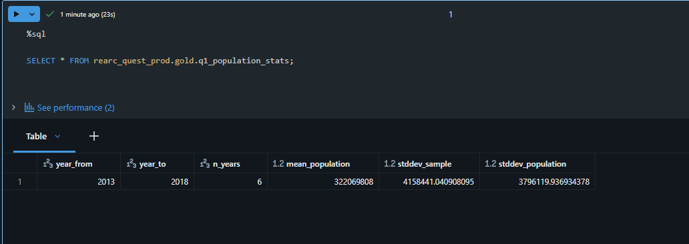

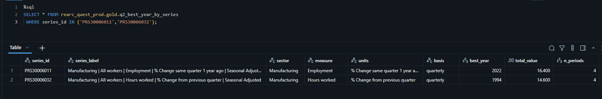

Q3, scrolled to the population-matched years. **2020, 2025 and 2026 are `null`**
— the row is kept and the population is absent, rather than the year being
dropped by an inner join:

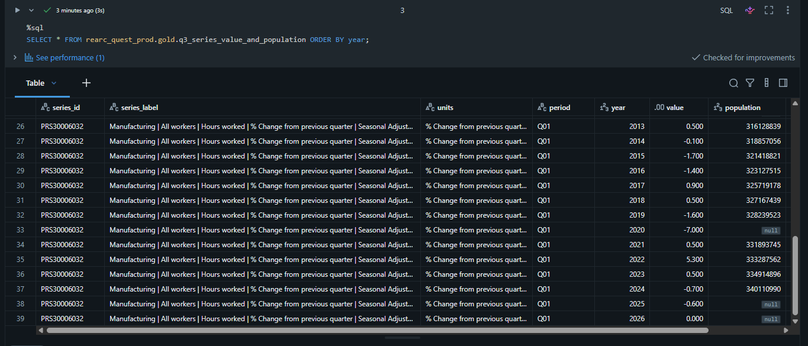

</details>

---

## How it fits together

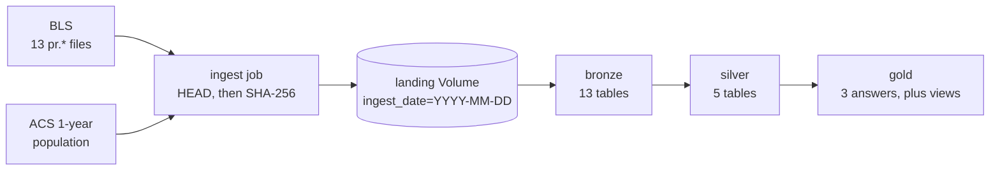

All three layers are one pipeline, not three — a dataset that names itself fully
publishes outside the pipeline's default schema, so a single dependency graph
spans the medallion and Gold can never be computed from a stale Silver:

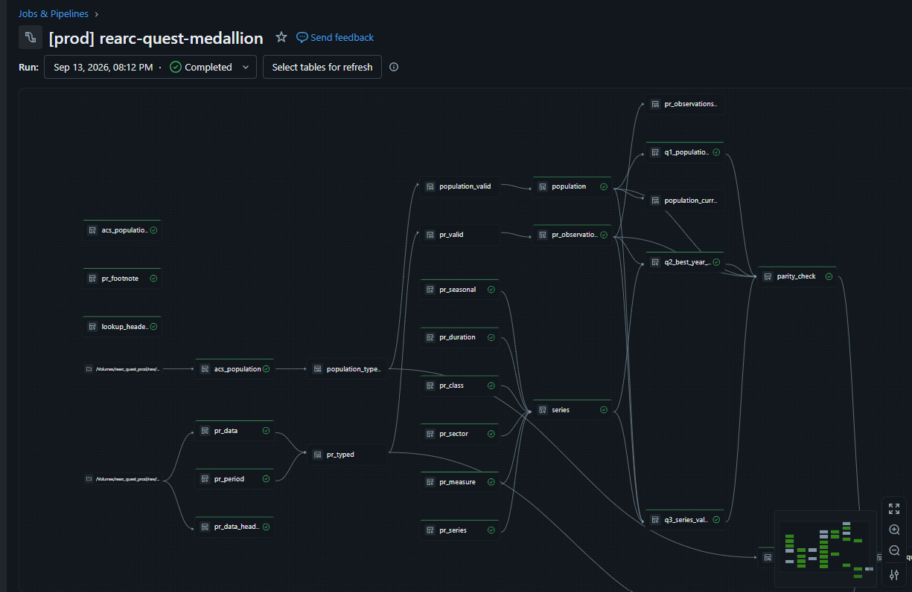

Filenames are discovered from the BLS directory listing rather than hardcoded,
every file is `HEAD`-checked before any body transfers, and only a SHA-256
difference causes one to land. **A second run transfers 2,748 bytes** — the
directory listing, which discovery must always fetch, and the population payload,
which offers no `Last-Modified`:

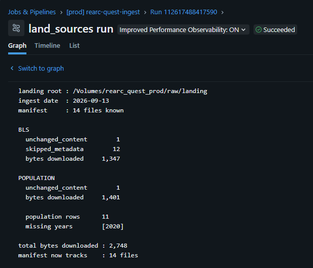

---

## Running it

### Prerequisites

- A Databricks workspace with Unity Catalog. Built and tested on **Free Edition**
  (serverless only).
- [Databricks CLI](https://docs.databricks.com/dev-tools/cli/) ≥ 1.16
- [uv](https://docs.astral.sh/uv/) — for the local test suite only

### One-time setup

Steps 1–3 create the three things the bundle deliberately does not: catalogs,
because the API refuses them under Default Storage, and identities, because
identity lifecycle belongs to IT rather than to a data product.

1. **Create the catalogs in the workspace UI** — `rearc_quest_dev` and
   `rearc_quest_prod`. Everything beneath them is bundle-owned.
2. **Create an account group** for the read-only analyst — `rearc_analysts_group`
   by default. Account console → **Identity and access** → **Groups**. It must be
   an *account* group: Unity Catalog cannot see workspace-local groups and rejects
   them with `PRINCIPAL_DOES_NOT_EXIST`, which fails the deploy.
3. **Create a service principal** for production, and note its Application ID.
4. **Point the bundle at your workspace.** In [`databricks.yaml`](databricks.yaml),
   set `workspace.host` on both targets, then repoint these four variables — each
   currently names something specific to the workspace this was built in:

   | variable | what it is |
   |---|---|
   | `contact_email` | Sent in the User-Agent — BLS returns **403** without it |
   | `analyst_group` | The account group from step 2 |
   | `prod_service_principal` | The Application ID from step 3 |
   | `engineer_principal` | You — read access across every layer, for debugging |

5. **Authenticate.** The host alone resolves credentials; there is no `profile:`
   to keep in sync.

   ```powershell
   databricks auth login --host https://<your-workspace>.cloud.databricks.com
   ```

### Deploy and run

```powershell
databricks bundle validate
databricks bundle deploy
databricks bundle run ingest       # lands source files into the Volume
databricks bundle run medallion    # builds Bronze -> Silver -> Gold
```

Add `-t prod` for production. `dev` is the default and applies a `dev_<user>_`
schema prefix, so two people can deploy the same bundle without collision.

After a **column type** change a plain run fails with `CANNOT_UPDATE_TABLE_SCHEMA`
— Delta cannot merge incompatible types into a live table:

```powershell
databricks bundle run medallion --full-refresh-all
```

That also resets the Auto Loader checkpoints and rebuilds every table from the
landed files alone, which is how reproducibility was verified rather than assumed.

### Query the answers

```sql
SELECT * FROM rearc_quest_prod.gold.q1_population_stats;
SELECT * FROM rearc_quest_prod.gold.q2_best_year_by_series ORDER BY series_id;
SELECT * FROM rearc_quest_prod.gold.q3_series_value_and_population ORDER BY year;

-- Five checks, every one expected to read 0
SELECT * FROM rearc_quest_prod.gold.data_quality;
```

On `dev` the schemas carry the `dev_<user>_` prefix. No `.py`, `.sql` or `.yml`
here contains a literal catalog or schema name — every one resolves from the
bundle at runtime, so promotion changes no code.

### Continuous deployment

Push to **`dev`** and GitHub Actions lints, tests and deploys the dev target as
the repository owner. Push to **`main`** and it deploys prod as a service
principal, which owns every prod object it deploys and runs. Deploy only — no
job or pipeline is triggered by a push.

The same commit, pushed to each branch. Lint and test always run; the deploy
jobs are mutually exclusive:

| push to `dev` | push to `main` |
|---|---|
| 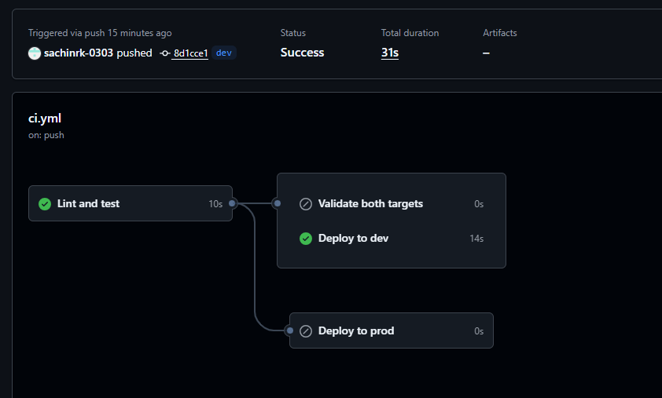 | 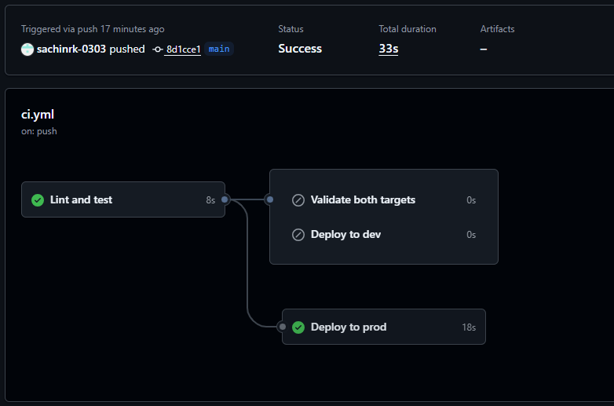 |

---

## Layout

```
databricks.yaml              bundle: variables, dev and prod targets
.github/workflows/ci.yml     lint, test, deploy per branch
resources/
  catalog.yml                schemas, landing Volume, grants
  ingest_job.yml             ingest task chained to the pipeline
  pipeline.yml               serverless pipeline, sources, configuration
src/
  run_ingest.py              job entry point
  ingest/                    pure Python, no Spark - runs locally too
    manifest.py              hashing, change decisions, ManifestStore protocol
    landing.py               land vs refresh-metadata-only
    bls.py                   discovery, contact UA, HEAD-before-GET
    population.py            Tesseract fetch, truncation guard
    delta_manifest.py        Delta-backed ManifestStore
    main.py                  orchestration, tombstones, argparse
  pipelines/                 <layer>_<subject>, one subject per file
    bronze_observations.py   bronze_lookups.py   bronze_population.py
    silver_observations.py   silver_population.py   silver_series.py
    gold_questions.sql       the three answers, Spark SQL
    gold_serving.sql         current-row views, the analyst's access boundary
    gold_parity.py           DataFrame API cross-check
tests/                       27 tests, no network and no Spark
PROCESS.md                   architecture, trade-offs, retrospective, AI usage
```

---

## How it is verified

```powershell
uv run pytest -q            # 27 tests — discovery, hashing, change detection, landing
uv run ruff check src tests
```

And continuously, inside the pipeline:

- **Header and column contracts** halt the run on a reorder or rename
- **Quarantine tables** hold anything Silver will not vouch for — both are empty
  across all 115,595 observations
- **`gold.parity_check`** compares each SQL answer against an independent
  DataFrame API implementation and fails on any differing row

`gold.data_quality` unions the two quarantine counts and the three parity results
into a single row set. All five read **0**:

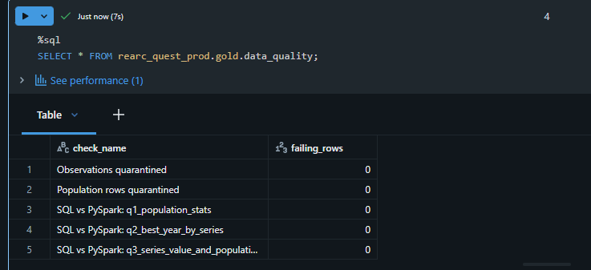

<details>
<summary><b>Access control, verified as the analyst rather than asserted</b></summary>

<br/>

The same user, in the same session. Gold resolves — a Unity Catalog view runs
with its owner's privileges, so all 77,126 current rows come back with no grant
on `silver` at all:

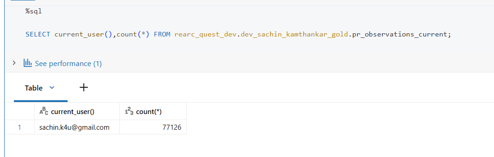

The table beneath it does not:

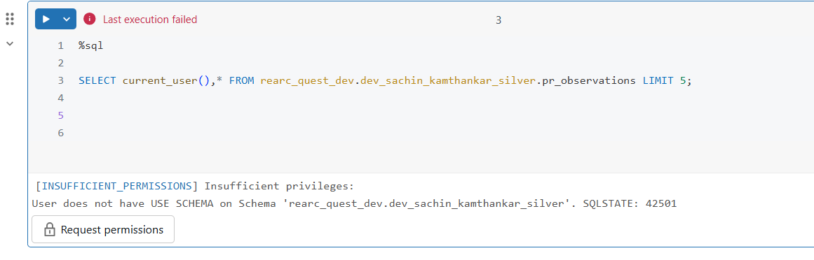

</details>

Every number above was reproduced in production, in an environment deployed by
CI and owned end to end by a service principal.

**[`docs/screenshots/`](docs/screenshots/)** holds the full set, including the
bundle-deployed job chain, the first ingest run for contrast with the idempotent
one, and the Genie space answering questions against Gold in plain English.
